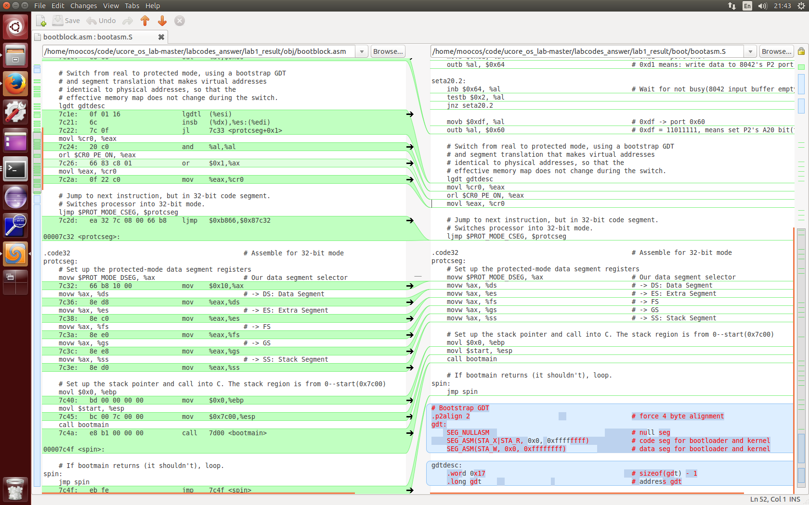

# LAB1 EX2
## Q 使用qemu执行并调试lab1中的软件
### 练习
从CPU加电后执行的第一条指令开始，单步跟踪BIOS的执行。
在初始化位置0x7c00设置实地址断点,测试断点正常。
从0x7c00开始跟踪代码运行,将单步跟踪反汇编得到的代码与bootasm.S和 bootblock.asm进行比较。
自己找一个bootloader或内核中的代码位置，设置断点并进行测试。

####gdb
file 加载某个待调试的程序
break 简写 b可设置断点 ，可设置满足某个条件才生效，如：
```
break 9 if sum!=0

```
continue 简写c（连续运行）在遇到断点后自动停止
set var 加上变量名可设置变量值
run (r) 从头开始重新运行
display(undisplay) 持续显示或停止显示某个变量
delete/disable/enable breakpoints 断点号 ： 删除/启用/禁用断点
x 显示内存中的内容
watch 设置观察点，当观察点对应的内存发生变化，给出提示

gdb调试段错误，书第125页
常用指令可查看书或者实验指导书

####gdb练习：调试bootasm.S
这里开始时遇到一点小问题，gdb调试的目标是可执行文件，其经过c变成汇编再变成目标文件再最后链接成可执行文件。ld 的 -o 输出即是可执行文件。
这里调试bootblock.o 并将断点打在start处（bootasm.s中的入口），调试运行。
####bootasm.S和 bootblock.asm进行比较
这里使用meld,传入两个文件，即可对比其不同


####一点小提示：点击qume终端后如若卡死，Ctrl+alt