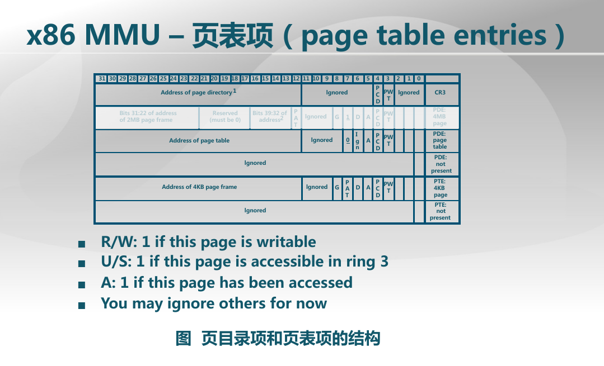

# LAB2 EX2

练习2：实现寻找虚拟地址对应的页表项（需要编程）

通过设置页表和对应的页表项，可建立虚拟内存地址和物理内存地址的对应关系。其中的get_pte函数是设置页表项环节中的一个重要步骤。此函数找到一个虚地址对应的二级页表项的内核虚地址，如果此二级页表项不存在，则分配一个包含此项的二级页表。本练习需要补全get_pte函数 in kern/mm/pmm.c，实现其功能。

请在实验报告中简要说明你的设计实现过程。请回答如下问题：

    请描述页目录项（Pag Director Entry）和页表（Page Table Entry）中每个组成部分的含义和以及对ucore而言的潜在用处。
    如果ucore执行过程中访问内存，出现了页访问异常，请问硬件要做哪些事情？

##A

1、有图片可知页目录项和页表项各占32位4字节，其中高20位为页表的基地址和页帧的基地址，低12位为一些标志位。这里的页表起始物理地址是按4096字节对齐的，即这个其实地址的低12位都是0，所以可以将这些低12位存一些别的权限信息，值得注意的标志位是该页是否可读写？用户态是否可以访问？该物理内存是否存在？
2、如果页访问异常（我的理解是找不到合适或者对应的物理帧？）这时候分配内存时就会抛出NULL?

PS.问题二不太理解，参考一下答案
-----------------
如果ucore执行过程中访问内存，出现了页访问异常，请问硬件要做哪些事情？
进行换页操作 首先 CPU 将产生页访问异常的线性地址 放到 cr2 寄存器中 
然后就是和普通的中断一样 保护现场 将寄存器的值压入栈中 
然后压入 error_code 中断服务例程将外存的数据换到内存中来 
最后 退出中断 回到进入中断前的状态（抄的）

#####顺便思考一下为何要分段三次？

PS：每个进程都有其对应的页表

写代码时遇到的小坑，一开始不了解页表\页目录项里究竟存了些啥，只是单纯的将其中的内容左移了12位，然后对三种地址印象更加深刻了一些，这里的虚拟地址可以说就是逻辑地址的偏移，线性地址是段基地址加上偏移，物理地址则是线性地址根据MMU得到的，ppt里说页表项里存的地址是线性地址，但是不是很理解，页表项存的不应该是物理页帧的基地址吗？但这里页机制还没启动，所以线性地址等于物理地址。在看看，希望后面能理解。

##上面小疑惑的解答：
https://piazza.com/class/i5j09fnsl7k5x0/post/1303
这些表项中存的应该就是物理地址。

###psss:
1、关于重新lgdt之后内核代码为何不跑飞
https://piazza.com/class/i5j09fnsl7k5x0/post/689
“你对“当lgdt了新的gdt以后，为什么加了偏移但是程序没有跑飞？”的理解是对的。注意，这里的jmp是 long jmp，这样保证了cpu一定会访问cs,从而触发使用新gdt表”

2、关于pmm_init中启动分页机制并重新加载GDT后为何 boot_pgdir[0] = 0;代码也不跑飞，因为此时0-4M线性地址映射到物理地址等于3G-3G+4M的线性地址映射到的物理地址（ph:0-4M）,所以其实boot_pgdir[0] = 0这句话从该角度来看可有可无，（代码验证过），但可能别的地方会有坑，所以取消了该映射。
