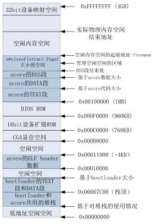

# LAB2 EX3

练习3：释放某虚地址所在的页并取消对应二级页表项的映射（需要编程）

当释放一个包含某虚地址的物理内存页时，需要让对应此物理内存页的管理数据结构Page做相关的清除处理，使得此物理内存页成为空闲；另外还需把表示虚地址与物理地址对应关系的二级页表项清除。请仔细查看和理解page_remove_pte函数中的注释。为此，需要补全在 kern/mm/pmm.c中的page_remove_pte函数。

请在实验报告中简要说明你的设计实现过程。请回答如下问题：

	1数据结构Page的全局变量（其实是一个数组）的每一项与页表中的页目录项和页表项有无对应关系？如果有，其对应关系是啥？
	2如果希望虚拟地址与物理地址相等，则需要如何修改lab2，完成此事？ 鼓励通过编程来具体完成这个问题

###Q1:数据结构Page的全局变量（其实是一个数组）的每一项与页表中的页目录项和页表项有无对应关系？如果有，其对应关系是啥？

###A:
以pte和页是数据结构为例
```
static inline struct Page *
pte2page(pte_t pte) {
    if (!(pte & PTE_P)) {
        panic("pte2page called with invalid pte");
    }
    return pa2page(PTE_ADDR(pte));
}
```
这段代码里的pte是pte中的内容，意思是如何根据pte中的内容找到其对应的PAGE结构体，其中PTE_ADDR(pte)
```
#define PTE_ADDR(pte)   ((uintptr_t)(pte) & ~0xFFF)
```
即将pte中的低12位置0,得到的是物理页帧的基地址，最后再根据pa2page将物理地址对应到其页数据结构上，
```
static inline struct Page *
pa2page(uintptr_t pa) {
    if (PPN(pa) >= npage) {
        panic("pa2page called with invalid pa");
    }
    return &pages[PPN(pa)];
}
```
&pages就是所有页的首地址，具体参考实验指导书以页为单位管理物理内存

也就是图中管理空闲空间的区域。
###A2:回答问题2之前，我决定先好好梳理一下pmm_init这个函数，和地址映射的4个阶段
第一阶段bootloader阶段，从即从bootloader的start函数（在boot/bootasm.S中）到执行ucore kernel的kern_\entry函数之前 

	lab2 stage 1： virt addr = linear addr = phy addr

第二个阶段从从kern_\entry函数开始，到执行enable_page函数（在kern/mm/pmm.c中）之前再次更新了段映射，还没有启动页映射机制。由于gcc编译出的虚拟起始地址从0xC0100000开始，ucore被bootloader放置在从物理地址0x100000处开始的物理内存中。
```
.align 4
__gdt:
    SEG_NULL
    SEG_ASM(STA_X | STA_R, - KERNBASE, 0xFFFFFFFF)      # code segment
    SEG_ASM(STA_W, - KERNBASE, 0xFFFFFFFF)              # data segment
__gdtdesc:
    .word 0x17                                          # sizeof(__gdt) - 1
    .long REALLOC(__gdt)

```


	 lab2 stage 2： virt addr - 0xC0000000 = linear addr = phy addr

第三个阶段从enable_page函数开始，到执行gdt_init函数（在kern/mm/pmm.c中）之前，启动了页映射机制，但没有第三次更新段映射。这时的虚拟地址，线性地址以及物理地址之间的映射关系比较微妙：

lab2 stage 3:  virt addr - 0xC0000000 = linear addr  = phy addr + 0xC0000000 # 物理地址在0~4MB之外的三者映射关系

	virt addr - 0xC0000000 = linear addr  = phy addr # 物理地址在0~4MB之内的三者映射关系

这里开始仔细看一下pmm_init这个函数：
```
init_pmm_manager();

    // detect physical memory space, reserve already used memory,
    // then use pmm->init_memmap to create free page list
    page_init();

    //use pmm->check to verify the correctness of the alloc/free function in a pmm
    check_alloc_page();

    // create boot_pgdir, an initial page directory(Page Directory Table, PDT)
    boot_pgdir = boot_alloc_page();
    memset(boot_pgdir, 0, PGSIZE);
    boot_cr3 = PADDR(boot_pgdir);

    check_pgdir();

    static_assert(KERNBASE % PTSIZE == 0 && KERNTOP % PTSIZE == 0);

    // recursively insert boot_pgdir in itself
    // to form a virtual page table at virtual address VPT
    boot_pgdir[PDX(VPT)] = PADDR(boot_pgdir) | PTE_P | PTE_W;

    // map all physical memory to linear memory with base linear addr KERNBASE
    //linear_addr KERNBASE~KERNBASE+KMEMSIZE = phy_addr 0~KMEMSIZE
    //But shouldn't use this map until enable_paging() & gdt_init() finished.
    boot_map_segment(boot_pgdir, KERNBASE, KMEMSIZE, 0, PTE_W);

    //temporary map: 
    //virtual_addr 3G~3G+4M = linear_addr 0~4M = linear_addr 3G~3G+4M = phy_addr 0~4M     
    boot_pgdir[0] = boot_pgdir[PDX(KERNBASE)];

    enable_paging();

    //reload gdt(third time,the last time) to map all physical memory
    //virtual_addr 0~4G=liear_addr 0~4G
    //then set kernel stack(ss:esp) in TSS, setup TSS in gdt, load TSS
    gdt_init();

    //disable the map of virtual_addr 0~4M
    boot_pgdir[0] = 0;
```
首先是
```
boot_pgdir = boot_alloc_page();
    memset(boot_pgdir, 0, PGSIZE);
    boot_cr3 = PADDR(boot_pgdir);

```
这里很明显分配了一个页帧作为后面要用的页目录表。
```
boot_pgdir[PDX(VPT)] = PADDR(boot_pgdir) | PTE_P | PTE_W;

```
这句话就很有意思了哈，就是说线性地址VPT所对应的二级页表其实是我们的页目录表，
也就是说将页目录项变成了一个页表，通过其查找到其中的物理地址（即各个页表的起始地址），这个页表对应了4M的物理内存（一个页表存1024个项，可表示4KB×1024=4M的内存）（这个就是自映射机制）具体看实验指导书那一节，然后看下一句
```
boot_map_segment(boot_pgdir, KERNBASE, KMEMSIZE, 0, PTE_W);
```
意思很简单，就是把从0XC000000开始的线性地址映射到0开始的物理地址，映射KMEMSIZE这么个大小。
再看下一句
```
 boot_pgdir[0] = boot_pgdir[PDX(KERNBASE)];
```
就是说线性地址0对应的物理地址和线性地址0XC000000对应的物理地址一样，因此，下面一句使能页机制后（线性地址0XC000000对应物理地址0,因此0-4M内的映射和之外的不一样）

 	lab2 stage 3:  virt addr - 0xC0000000 = linear addr  = phy addr + 0xC0000000 # 物理地址在0~4MB之外的三者映射关系
                virt addr - 0xC0000000 = linear addr  = phy addr # 物理地址在0~4MB之内的三者映射关系

最后
```
 gdt_init();

    //disable the map of virtual_addr 0~4M
    boot_pgdir[0] = 0;
```
重新设置GDT起始地址变为0,把boot_pgdir[0]的第一个页目录表项（0~4MB）清零来取消临时的页映射关系。

得到

	virt addr = linear addr = phy addr + 0xC0000000

为什么要操作这么多次呢？
阶段一没啥好说的，只是启动时做的操作，阶段2进入内核，此时虚拟地址（编程时用到的）和物理地址的关系为差一个kernbase,这里最关心得就是这两个地址，阶段三为何要0～4M和0～4M外不一致呢，首先使能页机制后，线性地址和物理地址的关系就确定了，为了确保虚拟地址和物理地址的关系不变，因此gdt更新，段机制的基地址要置0,而在gdt更新之前，为了确保内核代码中的虚拟地址和物理地址，线性地址的关系不变，（内核的空间在0-4M内）因此，页目录中第一项要更新 boot_pgdir[0] = boot_pgdir[PDX(KERNBASE)];
最后，gdt更新后则boot_pgdir[0] = 0;使得所有的映射满足统一关系。

###pss:
1、KERNBASE只是人为规定而已。内核需要将所有内存映射到所有进程的虚拟地址空间，这样进程在发起系统调用进入内核时不需要更换页表。ucore选择将内存映射到虚拟地址空间的高位（KERNBASE以上），使得应用程序可用的虚拟地址空间仍然从0开始。至于选择0xC0000000还是0xDEADBEEF，只是实现时的一个取值而已。
答案很简单，kernbase设为0就ok啦

###psSSS:看指导书建立虚拟页和物理页帧的地址映射关系
如何保证此时内核依然能够正常工作呢？其实只需让index为0的页目录项的内容等于以索引值为(KERNBASE>>22)的目录表项的内容即可。目前内核大小不超过 4M （实际上是3M，因为内核从 0x100000开始编址），这样就只需要让页表在0~4MB的线性地址与KERNBASE ~ KERNBASE+4MB的线性地址获得相同的映射即可，都映射到 0~4MB的物理地址空间，具体实现在pmm.c中pmm_init函数的语句：

	boot_pgdir[0] = boot_pgdir[PDX(KERNBASE)];

实际上这种映射也限制了内核的大小。当内核大小超过预期的3MB 就可能导致打开分页之后内核crash，在后面的试验中，也的确出现了这种情况。解决方法同样简单，就是拷贝更多的高地址对应的页目录项内容到低地址对应的页目录项中即可。

当执行完毕gdt_init函数后，新的段页式映射已经建立好了，上面的0~4MB的线性地址与0~4MB的物理地址一一映射关系已经没有用了。 所以可以通过如下语句解除这个老的映射关系。

	boot_pgdir[0] = 0;

###pssss
有空看看自映射