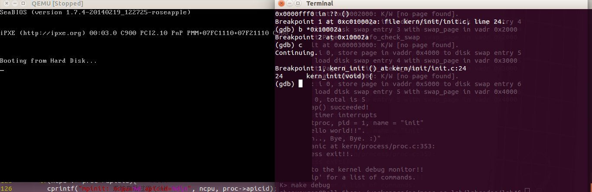

#lab3 ex0
#####先记录一个错题哈哈

	物理页帧数量为3，虚拟页访问序列为 0,1,2,0,1,3,0,3,1,0,3，请问采用最优置换算法的缺页次数为（）
解析：你本来选的是A，这是假定内存中已经预读入了0，1，2这3个页面；而实际上，程序在第一次运行时会有大量的缺页发生，因为内存中没有读入任何页面，这就是答案4次的由来，即在前3次读取时都会发生中断

#ps:关于GDB的一个重要问题
在后期的实验中，页表机制尚未建立起来之前，需要将逻辑地址减去0xc0000000再打断点,如 b *0x0010002a
感谢piazza:
https://piazza.com/class/i5j09fnsl7k5x0/post/190

哈哈，妈妈再也不用担心俺的调试了