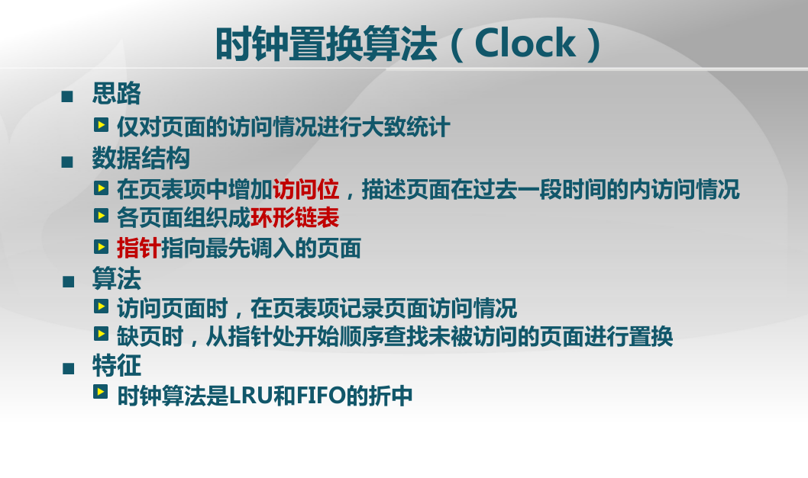
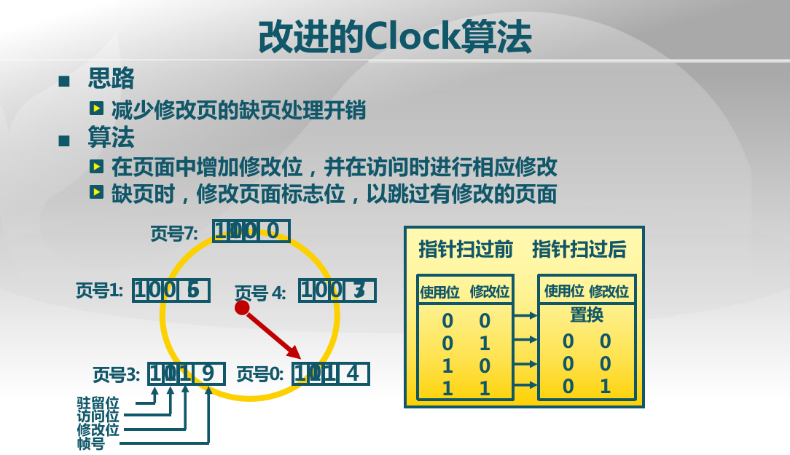
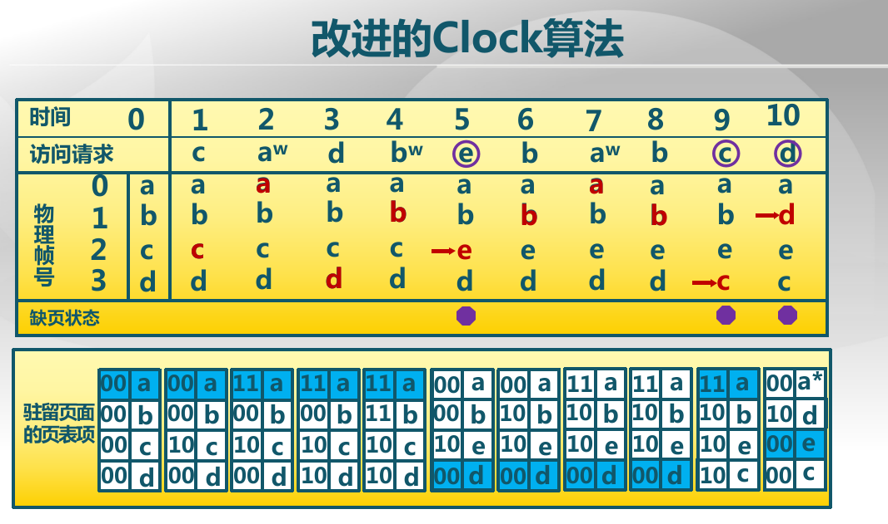
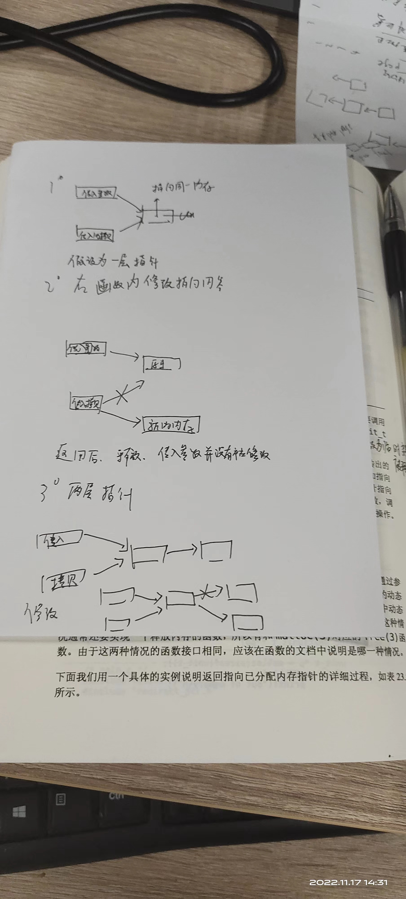

#lab3 ex1&2
####PS:(放一起写啦，主要FIFO太简单啦，没啥好说的)，主要记录一下坑，和lab3整个换入换出机制在代码中是如何实现的

###Q1:完成do_pgfault（mm/vmm.c）函数，
给未被映射的地址映射上物理页。设置访问权限 的时候需要参考页面所在 VMA 的权限，同时需要注意映射物理页时需要操作内存控制 结构所指定的页表，而不是内核的页表。
请在实验报告中简要说明你的设计实现过程。请回答如下问题：

	请描述页目录项（Pag Director Entry）和页表（Page Table Entry）中组成部分对ucore实现页替换算法的潜在用处。
	如果ucore的缺页服务例程在执行过程中访问内存，出现了页访问异常，请问硬件要做哪些事情？

###Q2:补充完成基于FIFO的页面替换算法
完成vmm.c中的do_pgfault函数，并且在实现FIFO算法的swap_fifo.c中完成map_swappable和swap_out_vistim函数。通过对swap的测试。

请在实验报告中回答如下问题：

	如果要在ucore上实现"extended clock页替换算法"请给你的设计方案，现有的swap_manager框架是否足以支持在ucore中实现此算法？如果是，请给你的设计方案。如果不是，请给出你的新的扩展和基此扩展的设计方案。并需要回答如下问题
	需要被换出的页的特征是什么？
	在ucore中如何判断具有这样特征的页？
	何时进行换入和换出操作？


###PS:在回答前两个问题前，先记录一下实验时候踩的坑
之前虚拟机崩溃后因为没备份，代码全丢了导致lab2的first_fit重写了一遍，在写alloc_pages的时候，如果pageproperty==n的情况下，忘记删除先前存在freelist里的那个对应空闲块，导致freelist里一直有东西，导致后面分配内存的时候一直出错，因为gdb此时还不知道咋用，调试用了最低级的打印出每次swap_out出的内存地址，以及每次FIFO前后（换入换出总共4种但其实早该想到的，因为换了答案的firstfit就不报错了。。。。

###A1:
昨天的浪费时间也不算全浪费，这里就简单介绍下换入换出机制在代码中是如何实现的。首先会用到中断，一旦发生中断，首先栈里会保存相关信息，然后调用中断服务例程
```
static void
trap_dispatch(struct trapframe *tf) {
    char c;

    int ret;

    switch (tf->tf_trapno) {
    case T_PGFLT:  //page fault
        if ((ret = pgfault_handler(tf)) != 0) {
            print_trapframe(tf);
            panic("handle pgfault failed. %e\n", ret);
        }
        break;

..........

static inline void
print_pgfault(struct trapframe *tf) {
    /* error_code:
     * bit 0 == 0 means no page found, 1 means protection fault
     * bit 1 == 0 means read, 1 means write
     * bit 2 == 0 means kernel, 1 means user
     * */
    cprintf("page fault at 0x%08x: %c/%c [%s].\n", rcr2(),
            (tf->tf_err & 4) ? 'U' : 'K',
            (tf->tf_err & 2) ? 'W' : 'R',
            (tf->tf_err & 1) ? "protection fault" : "no page found");
}

static int
pgfault_handler(struct trapframe *tf) {
    extern struct mm_struct *check_mm_struct;
    print_pgfault(tf);
    if (check_mm_struct != NULL) {
        return do_pgfault(check_mm_struct, tf->tf_err, rcr2());
    }
    panic("unhandled page fault.\n");
}
```
异常处理不了，报错，处理完了，调用iret返回到异常发生的位置重新执行。
然后就是do_pgfault这个函数，这个函数首先完成，非虚拟内存换入换出引起的异常解决方案，一般是一些读写权限或者用户态特权态引起的权限问题，然后就是由于缺页或者虚拟页不在物理内存而在硬盘的swap分区中引起的异常解决，大致思路是首先找到虚拟地址对应的pte然后建立pte和物理地址之间的映射关系。如果该虚拟页pte中的内容表示其不再物理内存而是在swap分区中，则会先分配一个物理页，并将swap分区中保存的页换出并将其保存到这个物理页上，再重新构建虚拟地址和物理地址的映射关系（即重写页表并刷新快表）。最后，将该页设置为可以替换（swappable)。最后，将page数据结构维护的pra_vaddr(表示这个page对应的虚拟页地址）设置为该虚拟页。

然后这里的alloc_pages函数也做了改写，当有空闲物理页时，那么正常分配，否则，会调用FIFO算法，将可替换页中的最久项写入swap分区中，然后free该物理页，并将其分配出去。

为了维护虚拟内存的换入换出操作，维护了vma_struct，mm_struct等，并对page数据结构做了修改，添加了一个swap专用的双向链表，**具体看实验指导书的lab3的虚拟内存管理的关键数据结构及相关函数分析。**

最后来写下思考题
Q1:
1.方便了解对页的操作权限（读写以及用户权限）可以将保存在外存硬盘的位置保存在页表项里
2.上次答过了
Q2:
时钟算法




现有的不行，要增加一个定时向外存写修改过的内存的算法，并需要维护一个数据结构来存放这些需要写出的算法？暂时不懂为何修改过就一定要同步到外存。

###PS：抄的答案
Q2:如果要在ucore上实现"extended clock页替换算法"请给你的设计方案，现有的swap_manager框架是否足以支持在ucore中实现此算法？如果是，请给你的设计方案。如果不是，请给出你的新的扩展和基此扩展的设计方案。并需要回答如下问题
在现有框架基础上可以支持Extended clock算法，具体设计方案如下所示：

根据上文中提及到的PTE的组成部分可知，PTE中包含了dirty位和访问位，因此可以确定某一个虚拟页是否被访问过以及写过，但是，考虑到在替换算法的时候是将物理页面进行换出，而可能存在着多个虚拟页面映射到同一个物理页面这种情况，也就是说某一个物理页面是否dirty和是否被访问过是有这些所有的虚拟页面共同决定的，而在原先的实验框架中，物理页的描述信息Page结构中默认只包括了一个对应的虚拟页的地址，应当采用链表的方式，在Page中扩充一个成员，把物理页对应的所有虚拟页都给保存下来；而物理页的dirty位和访问位均为只需要某一个对应的虚拟页对应位被置成1即可置成1；
完成了上述对物理页描述信息的拓展之后，考虑对FIFO算法的框架进行修改得到拓展时钟算法的框架，由于这两种算法都是将所有可以换出的物理页面均按照进入内存的顺序连成一个环形链表，因此初始化，将某个页面置为可以/不可以换出这些函数均不需要进行大的修改(小的修改包括在初始化当前指针等)，唯一需要进行重写的函数是选择换出物理页的函数swap_out_victim，对该函数的修改如下：
从当前指针开始，对环形链表进行扫描，根据指针指向的物理页的状态（表示为(access, dirty)）来确定应当进行何种修改：
如果状态是(0, 0)，则将该物理页面从链表上去下，该物理页面记为换出页面，但是由于这个时候这个页面不是dirty的，因此事实上不需要将其写入swap分区；
如果状态是(0, 1)，则将该物理页对应的虚拟页的PTE中的dirty位都改成0，并且将该物理页写入到外存中，然后指针跳转到下一个物理页；
如果状态是(1, 0), 将该物理页对应的虚拟页的PTE中的访问位都置成0，然后指针跳转到下一个物理页面；
如果状态是(1, 1)，则该物理页的所有对应虚拟页的PTE中的访问为置成0，然后指针跳转到下一个物理页面；
需要被换出的页的特征是什么？

该物理页在当前指针上一次扫过之前没有被访问过；
该物理页的内容与其在外存中保存的数据是一致的, 即没有被修改过;
在ucore中如何判断具有这样特征的页？

在ucore中判断具有这种特征的页的方式已经在上文设计方案中提及过了，具体为：
假如某物理页对应的所有虚拟页中存在一个dirty的页，则认为这个物理页为dirty，否则不这么认为；
假如某物理页对应的所有虚拟页中存在一个被访问过的页，则认为这个物理页为被访问过的，否则不这么认为；
何时进行换入和换出操作？

在产生page fault的时候进行换入操作；
换出操作源于在算法中将物理页的dirty从1修改成0的时候，因此这个时候如果不进行写出到外存，就会造成数据的不一致，具体写出内存的时机是比较细节的问题, 可以在修改dirty的时候写入外存，或者是在这个物理页面上打一个需要写出的标记，到了最终删除这个物理页面的时候，如果发现了这个写出的标记，则在这个时候再写入外存；后者使用一个写延迟标记，有利于多个写操作的合并，从而降低缺页的代价；


Q1:可以发现无论是PTE还是TDE，都具有着一些保留的位供操作系统使用，也就是说ucore可以利用这些位来完成一些其他的内存管理相关的算法，比如可以在这些位里保存最近一段时间内该页的被访问的次数（仅能表示0-7次），用于辅助近似地实现虚拟内存管理中的换出策略的LRU之类的算法；也就是说这些保留位有利于OS进行功能的拓展；

作者：AmadeusChan
链接：https://www.jianshu.com/p/8d6ce61ac678
来源：简书
著作权归作者所有。商业转载请联系作者获得授权，非商业转载请注明出处。

##tips:C的一个小知识点
为何要用两层指针参数分配内存？
因为分配内存其实分配的是一个地址
传参数分 传值 和 传地址。
要改变所指向的内存单元的地址，即改变指针变量的内容，需要传地址，要用指针，即要指向指针的指针。

