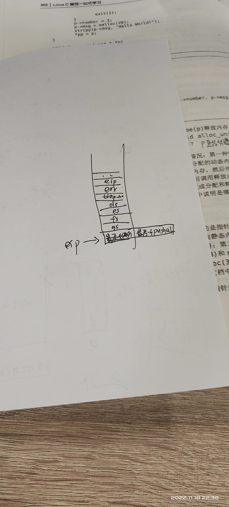

#lab4 ex0
一个有意思的选择题
关于创建新进程的描述正确的是（） s2

[x] fork() 创建子进程中，会复制父进程的所有变量和内存
[x] 子进程的fork()返回0
[x] 父进程的fork()在创建子进程成功后，返回子进程标识符
[x] fork() 创建子进程中，会复制父进程的页表

答案是都对

注意选项四，按理来说fork后的东西是复制的，不在同一个物理地址，那为何fork() 创建子进程中，会复制父进程的页表（这样不就是一个物理地址了吗）
原因是采用了Copy on Write  (COW) 技术
也就是只有进程空间的各段的内容要发生变化时，才会将父进程的内容复制一份给子进程。在fork之后exec之前两个进程用的是相同的物理空间（内存区），子进程的代码段、数据段、堆栈都是指向父进程的物理空间，也就是说，两者的虚拟空间不同，但其对应的物理空间是同一个。当父子进程中有更改相应段的行为发生时，再为子进程相应的段分配物理空间，如果不是因为exec，内核会给子进程的数据段、堆栈段分配相应的物理空间（至此两者有各自的进程空间，互不影响），而代码段继续共享父进程的物理空间（两者的代码完全相同）。而如果是因为exec，由于两者执行的代码不同，子进程的代码段也会分配单独的物理空间。

（注1：在理解时，你可以认为fork后，这两个相同的虚拟地址指向的是不同的物理地址，这样方便理解父子进程之间的独立性）
（注2：但实际上，linux为了提高 fork 的效率，采用了 copy-on-write 技术，fork后，这两个虚拟地址实际上指向相同的物理地址（内存页），只有任何一个进程试图修改这个虚拟地址里的内容前，两个虚拟地址才会指向不同的物理地址（新的物理地址的内容从原物理地址中复制得到））
————————————————
版权声明：本文为CSDN博主「狂奔的乌龟」的原创文章，遵循CC 4.0 BY-SA版权协议，转载请附上原文出处链接及本声明。
原文链接：https://blog.csdn.net/xy010902100449/article/details/44851453

###再把lab1的老坑填一下下
中断调用究竟是一个什么样的过程？
先copy一下实验指导书：
(3) 中断的处理过程

trap函数（定义在trap.c中）是对中断进行处理的过程，所有的中断在经过中断入口函数__alltraps预处理后 (定义在 trapasm.S中) ，都会跳转到这里。在处理过程中，根据不同的中断类型，进行相应的处理。在相应的处理过程结束以后，trap将会返回，被中断的程序会继续运行。整个中断处理流程大致如下：

产生中断后，CPU 跳转到相应的中断处理入口 (vectors)，并在桟中压入相应的 error_code（是否存在与异常号相关） 以及 trap_no，然后跳转到 alltraps 函数入口：
注意：此处的跳转是 jmp 过程


```
.globl vector2
vector2:
  pushl $0
  pushl $2
  jmp __alltraps
```
0是errcode,2是中断号

然后在栈中保存当前被打断程序的 trapframe 结构(参见过程trapasm.S)。设置 kernel (内核) 的数据段寄存器，最后压入 esp，作为 trap 函数参数(struct trapframe * tf) 并跳转到中断处理函数 trap 处：

注意：此时的跳转是 call 调用，会压入返回地址 eip，注意区分此处eip与trapframe中eip：
trapframe的结构为：
进入 trap 函数，对中断进行相应的处理：

####注意
```
.globl __alltraps
__alltraps:
    # push registers to build a trap frame
    # therefore make the stack look like a struct trapframe
    pushl %ds
    pushl %es
    pushl %fs
    pushl %gs
    pushal

    # load GD_KDATA into %ds and %es to set up data segments for kernel
    movl $GD_KDATA, %eax
    movw %ax, %ds
    movw %ax, %es

    # push %esp to pass a pointer to the trapframe as an argument to trap()
    pushl %esp

    # call trap(tf), where tf=%esp
    call trap

    # pop the pushed stack pointer
    popl %esp
    .globl __trapret
__trapret:
    # restore registers from stack
    popal

    # restore %ds, %es, %fs and %gs
    popl %gs
    popl %fs
    popl %es
    popl %ds

    # get rid of the trap number and error code
    addl $0x8, %esp
    iret
```
```
struct trapframe {
    struct pushregs tf_regs;
    uint16_t tf_gs;
    uint16_t tf_padding0;
    uint16_t tf_fs;
    uint16_t tf_padding1;
    uint16_t tf_es;
    uint16_t tf_padding2;
    uint16_t tf_ds;
    uint16_t tf_padding3;
    uint32_t tf_trapno;
    /* below here defined by x86 hardware */
    uint32_t tf_err;
    uintptr_t tf_eip;
    uint16_t tf_cs;
    uint16_t tf_padding4;
    uint32_t tf_eflags;
    /* below here only when crossing rings, such as from user to kernel */
    uintptr_t tf_esp;
    uint16_t tf_ss;
    uint16_t tf_padding5;
} __attribute__((packed));
```
这段汇编配合上trapframe这个数据结构就很有意思了哈，汇编很简单哈就是把一些段寄存器入栈，然后pushal就是入栈所有通用寄存器（eax ebx ecx。。。这些）然后有因为堆栈这里是从高向低入栈的，而分配一个struct数据结构时则是正常的低到高的一段地址空间，然后这里trapframe是trap这个函数的参数（是一个指针），又由前面知道call一个函数时（这里call的是trap）会把函数的参数先压栈，因此call之前压得最后一个是当前的esp(是一个地址)从esp开始到esp+trapframe大小的空间就是我们的trapframe

这里的eip和trapframe里的eip不一样，具体看实验指导书中断异常（反正也是压一堆寄存器啦，不过是硬件做的）
说白了此时trapframe这个指针的指向的是当前的esp，正好从esp开始计数，这些内存里存的都是结构体trapframe里定义的东西
###这里讲一下自己的理解（为何内核线程的栈顶要保留一个trapframe大小的数据结构咧）

首先从特权级的切换讲起，特权级的切换方式有很多，ucore这里采用的是中断的方式来实现，首先从ring3到ring0，

	1、产生中断
    2、内核栈里压入SS(RPL=3),ESP,EFLAGS,CS(RPL=3),EIP,ERROR CODE
    3、更新内核栈，删除SS,ESP(因为此时已经在ring0),CS的RPL = 0，更新EIP,指向你想执行的代码
    4、iret（恢复上述所有压栈的寄存器信息）以后就在ring0执行你想执行的程序啦


其实到这一步就可以解释为何内核线程的顶部要保留trapframe这么一个数据结构啦，首先要讲一讲TSS这么一个段啦（TASK STATE SEGMENT）

其实只看最下面就发现它保存了你要切换的内核栈的信息（SS0&ESP0）即当前内核栈的位置和它的ESP指向哪。所以在切换线程时，实验指导书有这么一句话
> 设置任务状态段ts中特权态0下的栈顶指针esp0为next内核线程initproc的内核栈的栈顶，即next->kstack + KSTACKSIZE ；


> 注意，在第二步设置任务状态段ts中特权态0下的栈顶指针esp0的目的是建立好内核线程或将来用户线程在执行特权态切换（从特权态0<-->特权态3，或从特权态3<-->特权态3）时能够正确定位处于特权态0时进程的内核栈的栈顶，而这个栈顶其实放了一个trapframe结构的内存空间。

也就是说如果此时发生了一个ring3到ring0的中断，那么由于我们设置好了TSS的ESP为栈的最开始，所以为此要保留一个trapframe大小的空间。不然每次更新ESP都要更新TSS,比较麻烦（我的理解，在看看大佬的答案）

说到这里，其实对于栈的理解也应该有更多的感悟：这里栈会保存参数，函数的返回地址，局部变量（因为函数调用的递归特性非常适合栈这种数据结构）同时也会保存中断产生的寄存器信息，方便恢复，而代码的执行一般是在代码段。

##ps：一些解答
> A:关于idleproc和initproc切换时的通用寄存器恢复问题
> idleproc创建完initproc之后继续运行并等待调度，真正切换是发生在schedule函数里面switch_to把两个进程的通用寄存器分别进行了保存和恢复，但initproc之后执行的位置是forkret也就是说我们模拟了一次中断（其实这里应该并没中断），然后iret了，但是在iret之前popal又把所有通用寄存器刷新了一遍。。前面的switch_to意义何在。一般来说，如果进程切换是先中断的，那么tf应该存了一份regs，然后你swtich_to换一遍regs，可是iret之前还得刷新一遍，所以context和tf->tf_regs到底有什么区别=_=

> 我的理解是
> tf在lab4中的使用：tf用来保存中断帧，在lab4中线程初始化的时候被使用，之后的lab中还被用于处理中断、特权级切换。在调度通过switch_to第一次切换到线程时，先进入forkret函数，这个函数利用中断帧起到一个权限改变的作用。之后，forkret函数根据中断帧的情况iret到kernel_thread_entry这个通用的线程入口函数，由这个函数跳转到线程的执行地址(在*%ebx中)。
> 总的来说，两者的定位完全不同。tf是用来处理中断的，里面会记录中断时候的信息，交给trap处理。而context是用来切换进程的。你会产生它们作用重叠，仅仅是因为，在一个进程第一次起来的时候，系统是通过构造中断帧跳转到用户态的，看起来就像tf起到了切换的作用。
