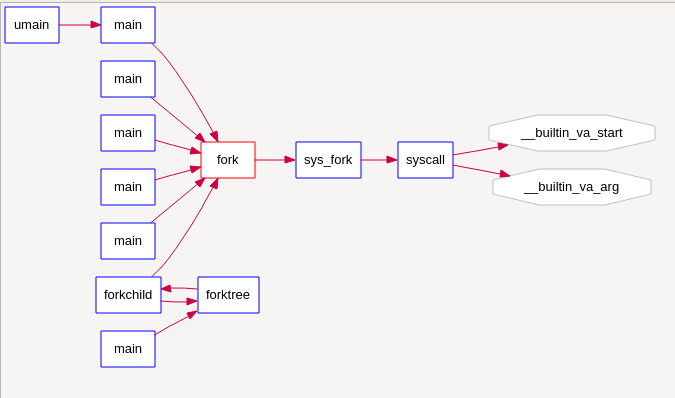
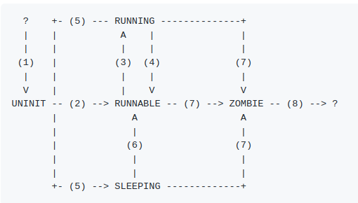

#lab5 ex3
请在实验报告中简要说明你对 fork/exec/wait/exit函数的分析。并回答如下问题：

请分析fork/exec/wait/exit在实现中是如何影响进程的执行状态的？
请给出ucore中一个用户态进程的执行状态生命周期图（包执行状态，执行状态之间的变换关系，以及产生变换的事件或函数调用）。（字符方式画即可）

再看一下syscall的代码
```
static inline int
syscall(int num, ...) {
    va_list ap;
    va_start(ap, num);
    uint32_t a[MAX_ARGS];
    int i, ret;
    for (i = 0; i < MAX_ARGS; i ++) {
        a[i] = va_arg(ap, uint32_t);
    }
    va_end(ap);

    asm volatile (
        "int %1;"
        : "=a" (ret)
        : "i" (T_SYSCALL),
          "a" (num),
          "d" (a[0]),
          "c" (a[1]),
          "b" (a[2]),
          "D" (a[3]),
          "S" (a[4])
        : "cc", "memory");
    return ret;
}
```
就是产生一个系统调用，（这里应该就会跳转到该进程的内核栈，在栈顶（保留的中断帧）压入返回用户态的参数，然后执行内核函数）(应该就是这样吧，有时间单步调试一下确认一下，但感觉没必要钻牛角)并根据参数执行特定的系统调用函数，这里就是调用do_fork创建新进程
exec一样，调用do_exec，清理页表并重新加载进程函数
wait调用do_wait释放僵尸子进程，只有调用了wait子进程的资源才会被释放
exit:
    1. call exit_mmap & put_pgdir & mm_destroy to free the almost all memory space of process
    2. set process' state as PROC_ZOMBIE, then call wakeup_proc(parent) to ask parent reclaim itself.
    3. call scheduler to switch to other process
##再copy一下大佬的答案（应该是要背的八股）
fork

fork创建了一个新的进程控制块，此时进程为UNINIT，然后将当前进程几乎所有信息复制到了新的进程。没有复制的信息包括内核栈和用于存放返回值的eax寄存器，它们都是新的。

在wakeup_proc被调用之后，进程状态变为RUNNABLE的就绪态。

exec

exec先将当前进程的内存布局（ mm结构体）清除干净，然后调用load_icode填写目标ELF映像中说明的内存布局。注意，进程的状态不发生变化。

wait

这个系统调用涉及两个进程，当前进程及其子进程。wait首先检查当前进程是否有子进程，若无则直接返回错误。接着，检查是否有ZOMBIE状态的子进程，若有则直接释放子进程残存的资源，然后立即返回子进程的返回状态码，此时子进程已不存在。

若没有ZOMBIE状态的子进程，此进程变为SLEEPING状态，等待这样的子进程出现，再进行上面的操作。

kill

这里的kill实现不是发信号，而是将指定进程的标记为设为EXITING，在下一次中断来临时，让进程调用exit来自己杀死自己，从而变成ZOMBIE状态。注意，kill并不直接改变进程的状态。

exit

这个系统调用涉及两个进程，当前进程及其父进程。exit会清除当前进程几乎所有资源，除了进程控制块以及内核栈，接着将其所有子进程的父进程置为init进程，然后将当前进程的状态变为ZOMBIE。若该进程有父进程，并且父进程正在等待子进程退出，则将父进程的状态从SLEEPING变为RUNNABLE态。

总结成状态转移图如图所示：


(1) alloc_proc

(2) wakeup_proc

(3) proc_run被调用时，作为proc_run的参数

(4) proc_run被调用时，作为proc_run的调用者

(5) 调用了wait（或sleep，上面没有涉及）

(6) 子进程调用了exit（或定时器超时，上面没有涉及）

(7) 调用了exit

(8) 父进程调用了wait