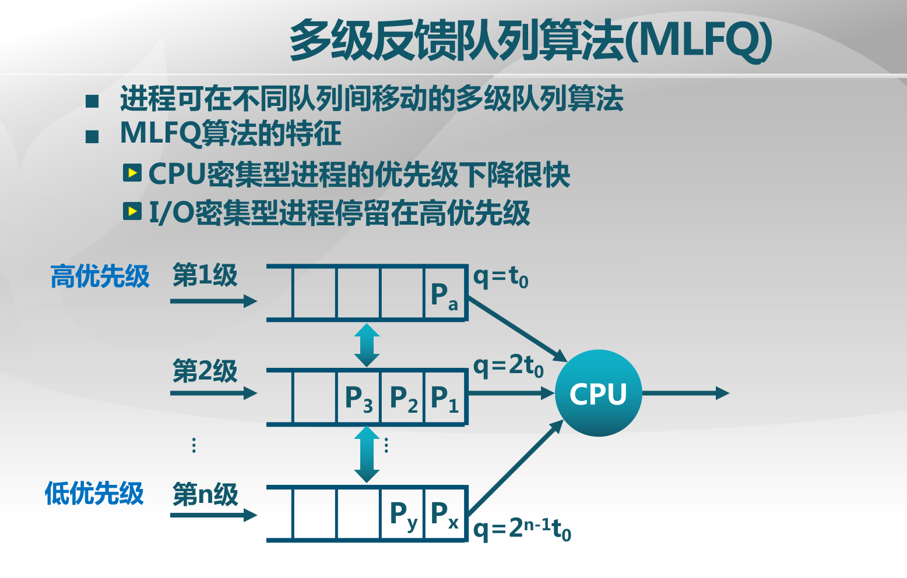

#lab6 ex1
练习1: 使用 Round Robin 调度算法
完成练习0后，建议大家比较一下（可用kdiff3等文件比较软件）个人完成的lab5和练习0完成后的刚修改的lab6之间的区别，分析了解lab6采用RR调度算法后的执行过程。执行make grade，大部分测试用例应该通过。但执行priority.c应该过不去。

请在实验报告中完成：

请理解并分析sched_calss中各个函数指针的用法，并接合Round Robin 调度算法描ucore的调度执行过程
请在实验报告中简要说明如何设计实现”多级反馈队列调度算法“，给出概要设计，鼓励给出详细设计

##lab5&6的区别
初始化PCB的时候多了一些进程控制块的信息
 * below fields(add in LAB6) in proc_struct need to be initialized
     *     struct run_queue *rq;                       // running queue contains Process
     *     list_entry_t run_link;                      // the entry linked in run queue
     *     int time_slice;                             // time slice for occupying the CPU
     *     skew_heap_entry_t lab6_run_pool;            // FOR LAB6 ONLY: the entry in the run pool
     *     uint32_t lab6_stride;                       // FOR LAB6 ONLY: the current stride of the process
     *     uint32_t lab6_priority;                     // FOR LAB6 ONLY: the priority of process, set by lab6_set_priority(uint32_t)


翻译


 struct proc_struct {
2        // . . .
3        // 该进程是否需要调度，只对当前进程有效
4        volatile bool need_resched;
5        // 该进程的调度链表结构，该结构内部的连接组成了 运行队列 列表
6        list_entry_t run_link;
7        // 该进程剩余的时间片，只对当前进程有效
8        int time_slice;
9        // round-robin 调度器并不会用到以下成员
10        // 该进程在优先队列中的节点，仅在 LAB6 使用
11        skew_heap_entry_t  lab6_run_pool;
12        // 该进程的调度优先级，仅在 LAB6 使用
13        uint32_t lab6_priority;
14        // 该进程的调度步进值，仅在 LAB6 使用
15        uint32_t lab6_stride;
16    };

这里的run_list是假设用双向链表来实现运行队列，那么tun_list就是其在链表中的对应，
如果用优先队列来实现，则这里的lab6_run_pool就是其在优先队列中的对应
一个小坑，时间片只能设0,不能设-1,具体看入队和pick_next的实现

```
1    struct run_queue {
2        //其运行队列的哨兵结构，可以看作是队列头和尾
3        list_entry_t run_list;
4        //优先队列形式的进程容器，只在 LAB6 中使用
5        skew_heap_entry_t  *lab6_run_pool;
6        //表示其内部的进程总数
7        unsigned int proc_num;
8        //每个进程一轮占用的最多时间片
9        int max_time_slice;
10    };
```
## sched_class分析
RR算法的sched_class
```
struct sched_class default_sched_class = {
    .name = "RR_scheduler",
    .init = RR_init,
    .enqueue = RR_enqueue,
    .dequeue = RR_dequeue,
    .pick_next = RR_pick_next,
    .proc_tick = RR_proc_tick,
};
```
具体看实验指导书3.5.4的分析
##多级反馈队列调度算法



###copy答案
调度算法的设计，其实是接口函数的实现的设计。

算法需要为每个优先级维护一个队列，然后维护一个当前优先级的运行状态。同时，还需要为每个进程记录当前所在的优先级，初始化时，优先级为最高优先级。

init

初始化算法维护的所有数据结构。

enqueue

若该进程时间片为0，说明是新进程或者刚刚用完了时间片，那么不改变其优先级，并将其放入相应优先级的队列中。

否则，说明该进程没有用完时间片，将其优先级降低一级，然后将其放入相应优先级的队列中。

最后，将进程的时间片置为相应优先级应有的时间片。

dequeue

从相应优先级的队列中将此进程取出即可。

pick_next

首先，根据调度算法维护的当前优先级的运行状态，利用某种调度算法（比如RR调度），选择下一个要执行的进程的优先级。

然后，从相应优先级队列中，取出一个进程返回。

proc_tick

这是基于时间片的调度算法，函数的功能或用法同上面所述。

