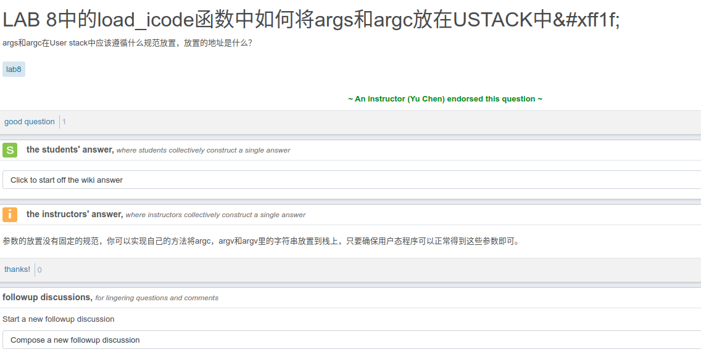

#LAB8 EX2
###练习2: 完成基于文件系统的执行程序机制的实现（需要编码）

改写proc.c中的load_icode函数和其他相关函数，实现基于文件系统的执行程序机制。执行：make qemu。如果能看看到sh用户程序的执行界面，则基本成功了。如果在sh用户界面上可以执行”ls”,”hello”等其他放置在sfs文件系统中的其他执行程序，则可以认为本实验基本成功。

####回答
丢人，一点不会写
进程结构体补全和dofork也是看了答案才明白的
然后load_icode关键有两点，首先是要明白elf和programe是怎么从外存加载到内存的，第二就是传递参数的时候，参数的个数以及参数是怎么保存在用户栈里的

上链接
https://www.jianshu.com/p/7e46a6ae0e8d
需要了解text,data，bss每一段到底是怎么回事，然后要知道参数是怎么存在栈里的，把linux c再看看。

用户栈顶要保存参数，是倒着保存的，栈底的就是kargv,最后保存argc(因为它也是参数？只是它代表的含义是参数的个数)

但是顺序应该是不能改动，除非你改用户态程序，让其从栈的不同地方读取参数。
至于前面的text,data,bss这些都是程序段，就按照programe里的这些段的虚拟地址信息，把他们读取到对应的虚拟地址空间即可。